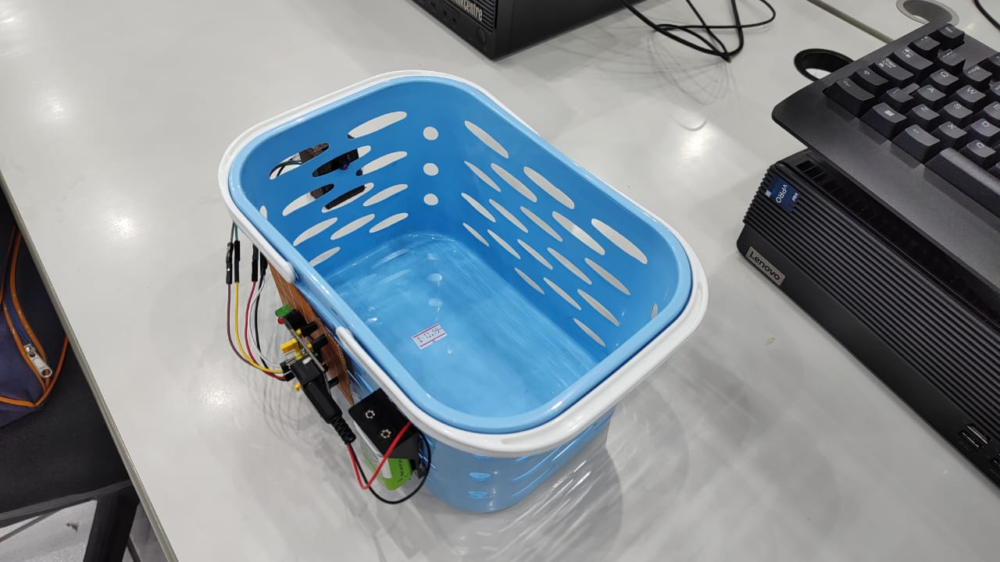

<h1 align="center" style="font-weight: bold;"> SmartMart</h1>

 <a href="#layout">Layout</a> • 
 <a href="#tech">Technologies</a> • 
 <a href="#presentation">Presentation</a> • 
 <a href="#hardware">Hardware</a> • 
 <a href="#architecture">Architecture</a> • 
  •
 <a href="#license">License</a>

    <b>Smart shopping basket made with Arduino, ESP32-CAM, Helix Sandbox NG, ASP.NET MVC, SQL Server</b>

<h2 id="layout">🎨 Layout</h2>

    
    
    
    
    
    
    
    
    
    

<h2 id="tech">💻 Technologies</h2>

<h2 id="presentation"> Presentation</h2>

https://youtu.be/2CAKUJLZz-4

<h2 id="hardware"> Hardware</h2>

    
    
    

<h2 id="architecture"> Architecture</h2>

    

<h2 id="colab">🤝 Collaborators</h2>

<table>
  <tr>
    <td align="center">
      <a href="https://github.com/lucassantuss">
         
          <b>Lucas Araujo</b>
      </a>
    </td>
    <td align="center">
      <a href="https://github.com/DanShiryu">
         
          <b>Danilo Rodrigues</b>
      </a>
    </td>
    <td align="center">
      <a href="https://github.com/GuerreiroRex">
         
          <b>Maik Soares</b>
      </a>
    </td>
    <td align="center">
      <a href="https://github.com/RenanCesarDeAraujo">
         
          <b>Renan Cesar</b>
      </a>
    </td>
  </tr>
</table>

<h2 id="license">🧾 License</h2>

This software is available under the following licenses:

- [MIT](LICENSE)
